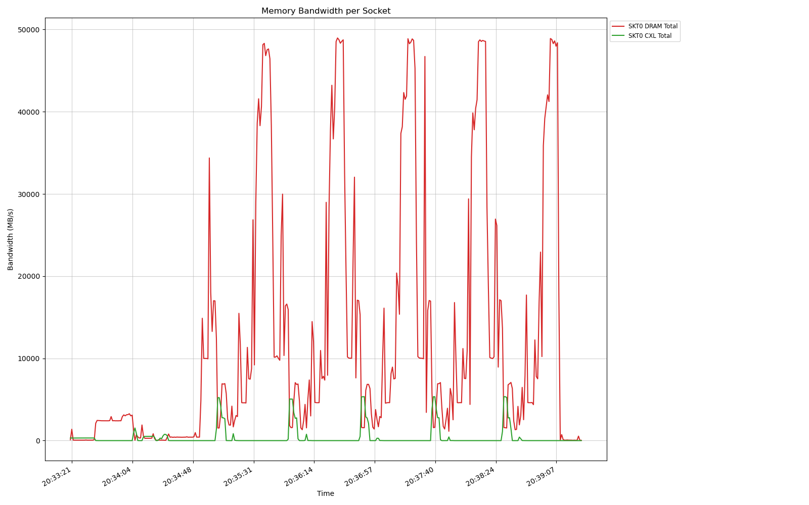

# DRAM-bandwidth-visualizer

A visualization tool for **Intel PCM memory bandwidth data** (including DRAM, PMM, and CXL memory).

This Python script parses the CSV output from `pcm-memory` (Intel Performance Counter Monitor) and plots bandwidth usage over time — either **read/write separately** or as **total bandwidth**.

---

##  Features

- Supports **multi-socket** systems (e.g., `SKT0`, `SKT1`, …)
- Parses **dual-line CSV headers** generated by `pcm-memory.x`
- Displays:
  - DRAM read/write bandwidth
  - PMM (Persistent Memory) read/write bandwidth
  - CXL (Compute Express Link) read/write bandwidth
- Two visualization modes:
  - `rw`: Separate read/write lines
  - `total`: Combined total (read + write)

---


## Requirements
- **Python**
- **Intel PCM** 
  (Tested with `pcm-memory` from PCM version **2023.2** and **2024.1**)  


## Usage

```bash

    sudo ./pcm-memory -csv=bandwidth_log.csv -i=1
    python3 vis_bandwidth.py -f bandwidth_log.csv -m rw

```
For example

```bash

PCM_BIN=/home/cxl_public/pcm/build/bin/pcm-memory
INTERVAL=1  
CSV_FILE="lulesh_bw.csv" 
MODE="rw"
sudo ${PCM_BIN} ${INTERVAL} -csv=${CSV_FILE} > /dev/null 2>&1 &
PCM_PID=$!
sleep 1
export OMP_NUM_THREADS=64
/usr/bin/time -v  numactl --cpunodebind=0  ./build/lulesh2.0 -i 5 -s 470 
sudo kill ${PCM_PID} >/dev/null 2>&1 || true
sleep 1
python3 ${VIS_BandWidth_PY}  -f ${CSV_FILE} -m ${MODE}

```

